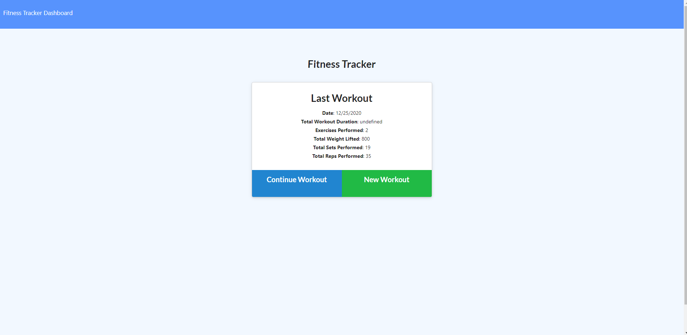
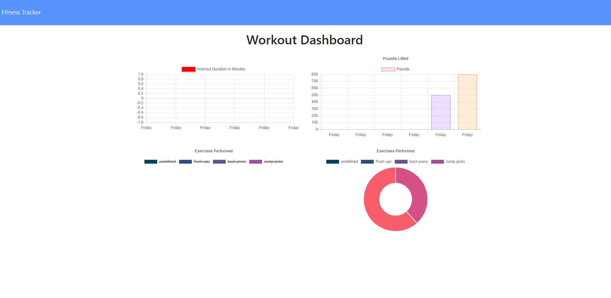

# FastFIT-Tracker
This is a fitness tracker application which helps a user keep track of their daily workouts and see their progress over time for each workout plan. It utilizes graphs to display each exercise and workout and compares them with other other exercises of the user so that the user can use this information to implemement new startegies in their workouts either to do more exercises for a particular workout type or to balance with another.

[FastFIT Repository](https://github.com/Terd47/FastFIT-Tracker)

[FastFIT Live Site](https://github.com/Terd47/FastFIT-Tracker)

## Techonologies used
- HTML
- CSS 
- BootStrap 4
- JavaScript
- Nodejs
- Express server
- Morgan
- Mongoose
- MongoDB

## User Story
As a user, I want to be able to view create and track daily workouts. I want to be able to log multiple exercises in a workout on a given day. I should also be able to track the name, type, weight, sets, reps, and duration of exercise. If the exercise is a cardio exercise, I should be able to track my distance traveled.
 
## ScreenShots
workout summary

workout statistics

